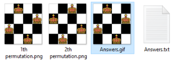
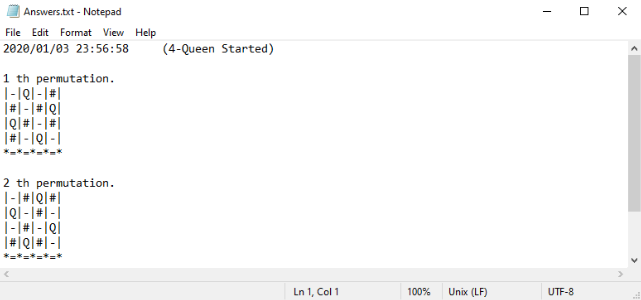
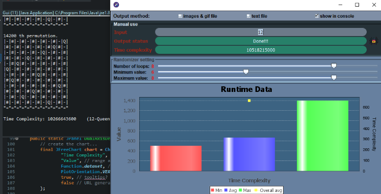

# N-Queen

### 4-Queen:


### 10-Queen (with all 724 permutations):


the generation already Answers are present for 4-Queen up to 10-Queen but only the final gif of 9-Quen and above is left as to reduce space.

output of images and, a gif of all the images is in:
````
N-Queen/src/Output/
````


the text answers for the aforementiond, is also present there.


It can also output the text version to the console


this project was made in `eclipse`

dependencies are `JAVA` and, the `jfreechart` library

the GUI was makde wiuth `swing`

### Fedora
````
sudo dnf install java-latest-openjdk.x86_64
````
## run N-Queen:
run it through eclipse:
````
flatpak install -y flathub org.eclipse.Java
````

